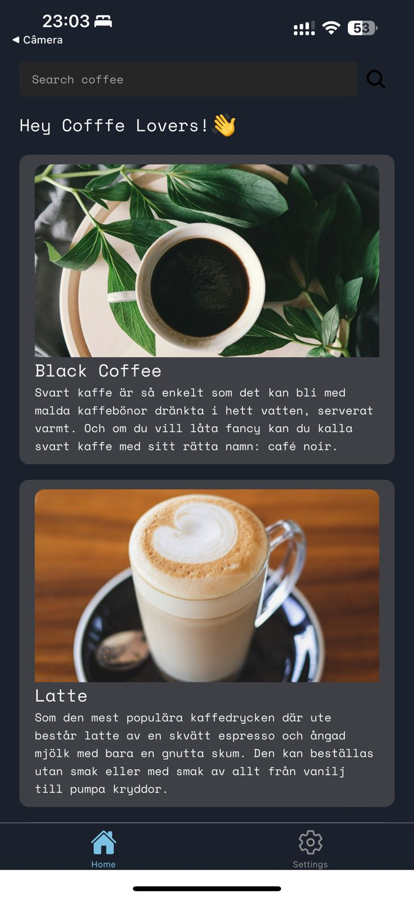
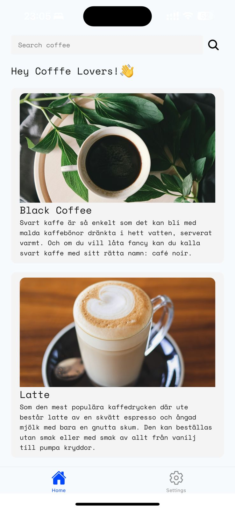

# Coffee-list

Coffee-list is a simple app to display a list of hot coffee drinks using data from the [Sample APIs](https://api.sampleapis.com/coffee/hot).
<p align="center">
  
  
</p>

## Features

- Fetch and display a list of hot coffee drinks.
- Supports both light and dark themes.

## Getting Started

These instructions will get you a copy of the project up and running on your local machine for development and testing purposes.

### Prerequisites

You need to have Node.js and Expo CLI installed. You can download Node.js from [here](https://nodejs.org/) and install Expo CLI globally by running:

```bash
npm install -g expo-cli
```

### Installation

1. Clone the repository

   ```bash
   git clone https://github.com/your-username/coffee-list.git
   cd coffee-list
   ```

2. Install dependencies

   ```bash
   npm install
   ```

### Running the App

1. Start the app

   ```bash
   npx expo start
   ```

2. Follow the instructions in the terminal to run the app on an emulator or a physical device.

## Built With

- [React Native](https://reactnative.dev/) - Framework for building native apps.
- [Expo](https://expo.dev/) - Toolset for developing and building React Native apps.
- [NativeBase](https://nativebase.io/) - For UI

## Acknowledgments

- [Sample APIs](https://api.sampleapis.com/) for providing the coffee API.
- Inspiration from coffee lovers around the world.